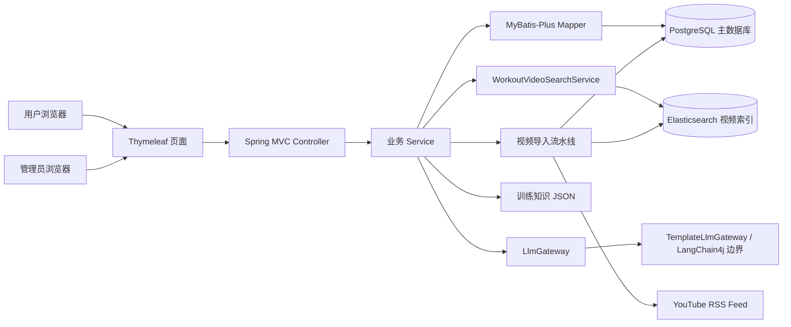
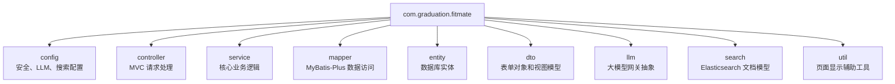
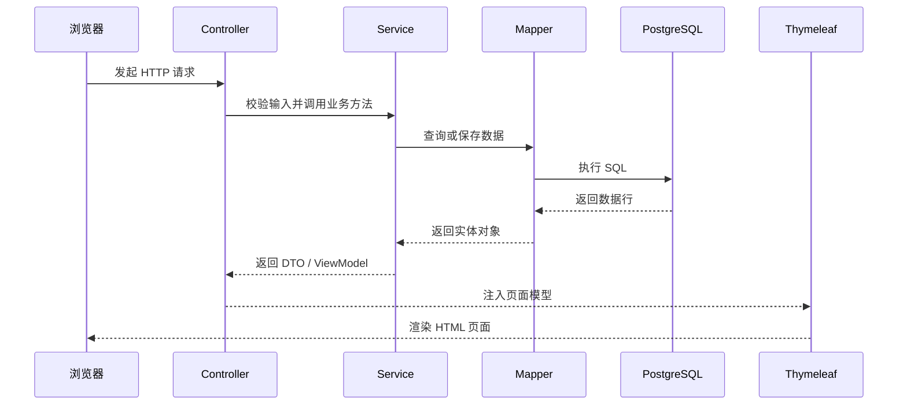
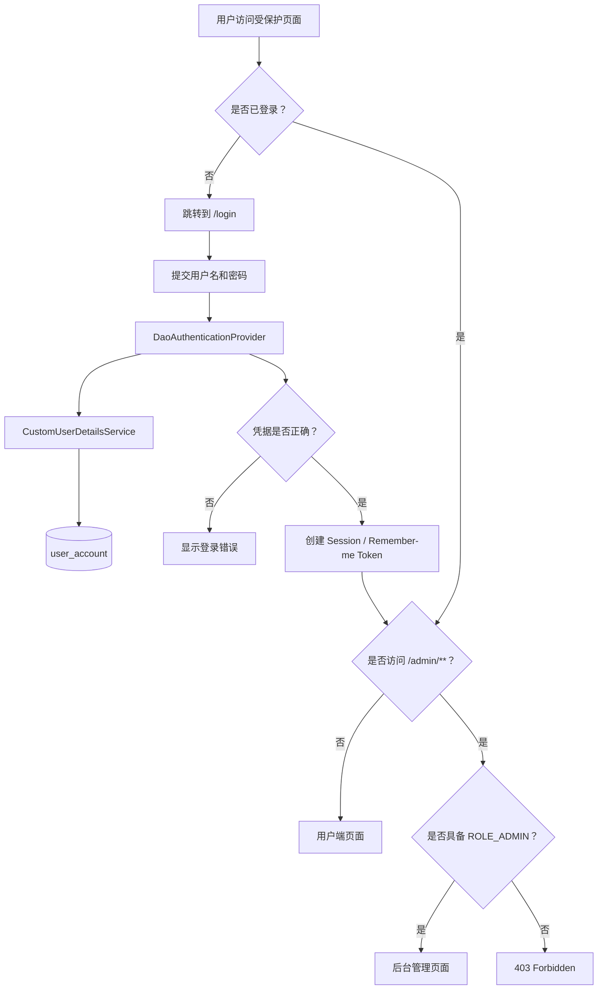
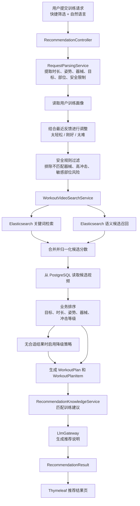
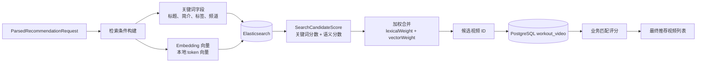
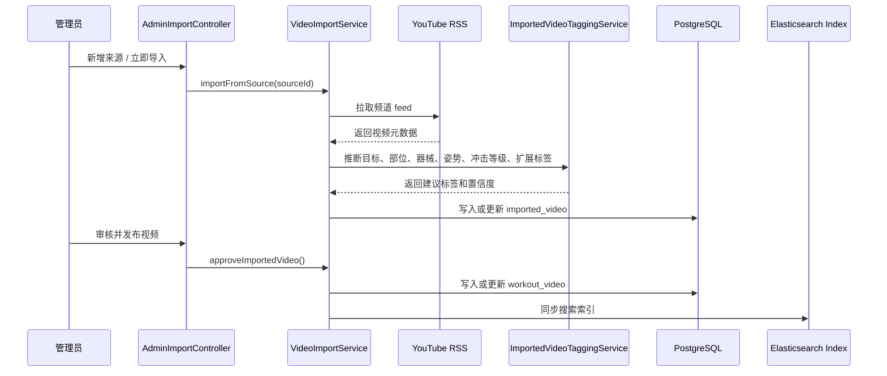
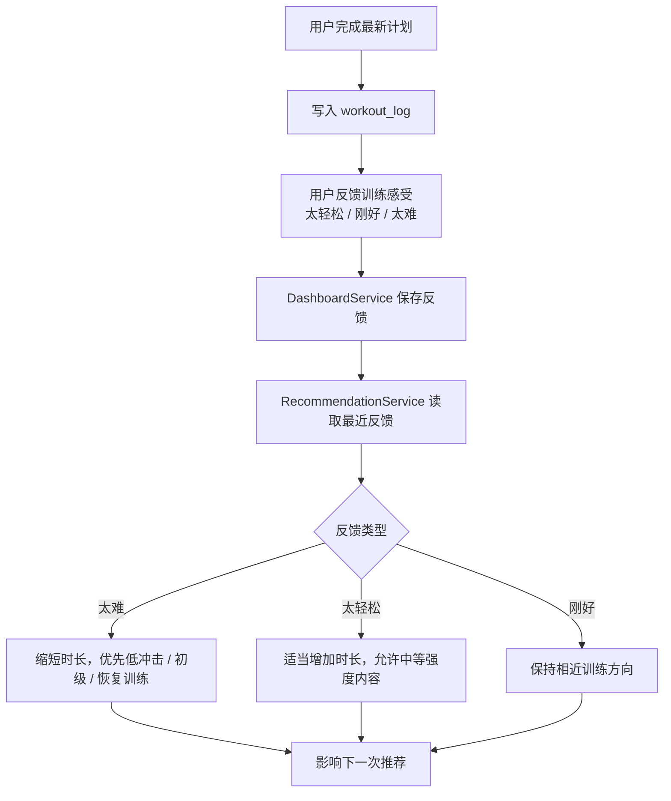
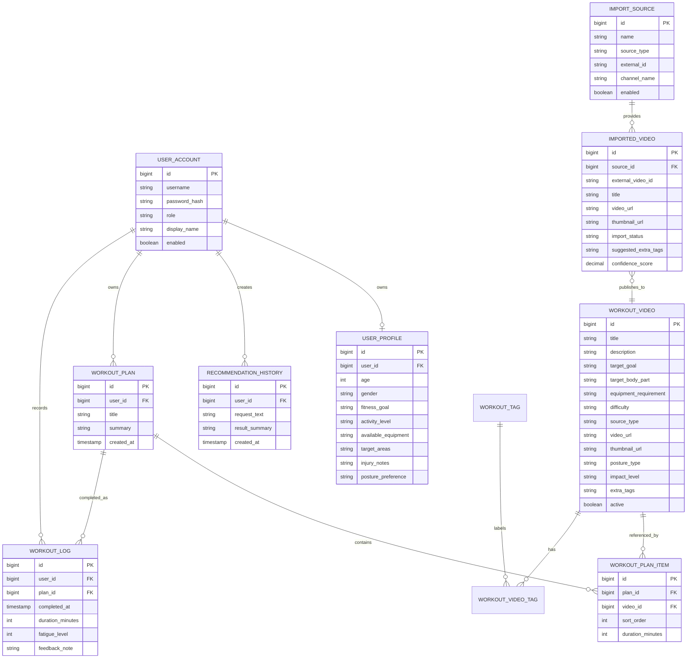
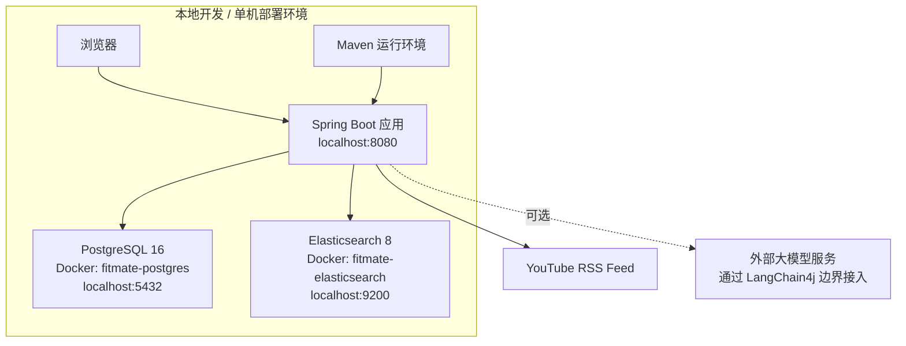

# FitMate 系统架构说明

FitMate 是一个基于 Java 的个性化健身推荐平台。用户可以维护训练画像，用自然语言描述训练需求，系统从经过整理的视频内容库中推荐更安全、更合适的训练视频，并记录训练完成情况和主观反馈。管理员负责维护训练内容库、导入 YouTube 频道内容、审核系统建议标签，并持续提升推荐内容质量。

## 1. 技术栈

| 层级 | 技术 | 职责 |
| --- | --- | --- |
| 页面渲染 | Thymeleaf、Bootstrap、原生 JavaScript | 服务端页面渲染、表单交互、语言切换、轻量前端交互 |
| Web 框架 | Spring Boot 3 | MVC 路由、依赖注入、配置管理、应用生命周期 |
| 安全认证 | Spring Security | 登录、记住登录、基于角色的访问控制 |
| 数据访问 | MyBatis-Plus、MyBatis XML | 常规 CRUD 和复杂查询 |
| 数据库 | PostgreSQL 16 | 用户、画像、视频、计划、日志、导入记录、推荐历史 |
| 数据库迁移 | Flyway | 表结构版本管理和初始化数据 |
| 检索服务 | Elasticsearch 8 | 视频关键词检索和语义候选召回 |
| 大模型接入边界 | LangChain4j 依赖 + `LlmGateway` 抽象 | 推荐解释生成和可替换的大模型提供方边界 |
| 本地 AI 支撑 | `TemplateLlmGateway`、`EmbeddingService`、知识库 JSON | 离线解释降级、本地向量生成、训练建议知识片段 |
| 部署 | Docker Compose + Maven | 本地 PostgreSQL、Elasticsearch 和 Spring Boot 应用运行 |

## 2. 系统总体架构图

系统采用分层单体架构。这样既方便毕设阶段开发、部署和讲解，也保留了清晰的模块边界：Controller 不直接访问数据库，推荐逻辑集中在 Service 层，搜索和大模型能力通过接口隔离，后续可以替换为更复杂的实现。

## 3. 代码包结构图

## 4. MVC 请求处理流程

典型页面流程：

- `HomeController`：渲染仪表盘，记录训练完成和反馈。
- `ProfileController`：维护用户训练画像。
- `RecommendationController`：接收快捷筛选和自然语言训练需求。
- `WorkoutVideoController`：展示视频列表和视频详情。
- `AdminVideoController`：管理训练视频和批量补标签。
- `AdminImportController`：管理频道导入、待发布视频审核。

## 5. 登录认证与权限控制

权限规则：

- 公开访问：`/`、`/login`、`/register`、`/css/**`
- 普通登录用户：仪表盘、个人资料、视频库、训练推荐
- 管理员：`/admin/**`
- 记住登录：使用 `persistent_logins` 表保存 token
- 页面导航：普通用户不显示后台入口，管理员才显示“管理”和“导入”

## 6. 推荐核心流程

这个系统没有让大模型直接决定视频结果。推荐链路先通过结构化解析、安全规则、数据库和 Elasticsearch 检索、确定性排序生成候选结果，最后再生成解释文案。这样推荐结果更可控，也更容易在答辩中解释安全性和可降级能力。

## 7. 检索与排序设计

当前检索特点：

- 关键词检索适合匹配明确需求，例如“椅子训练”“低冲击”“背部”。
- 语义候选召回可以提升相近表达的召回能力。
- 候选分数会展示在推荐结果中，用于解释“为什么排在这里”。
- Elasticsearch 不可用或没有安全候选时，会回退到数据库检索。

## 8. 内容导入流程

这条流水线减少了手动录入成本。系统自动获取标题、简介、缩略图、来源链接，并推断标签；管理员保留最终审核权，审核通过后才发布到正式训练内容库。

## 9. 用户反馈闭环

这个反馈闭环让仪表盘不只是展示页面。用户的训练完成情况和主观反馈会影响下一次推荐，使系统从“一次性推荐”变成“持续训练助手”。

## 10. 数据库 ER 图

## 11. 部署图

开发启动流程：

1. `docker compose up -d`
2. `mvn spring-boot:run`
3. 打开 `http://localhost:8080`

## 12. 核心组件职责

| 模块 | 主要类 | 职责 |
| --- | --- | --- |
| 登录认证 | `SecurityConfig`、`CustomUserDetailsService`、`RegistrationService` | 登录、角色权限、记住登录、注册 |
| 仪表盘 | `HomeController`、`DashboardService`、`DashboardView` | 今日进度、本周节奏、近期记录、训练反馈 |
| 用户画像 | `ProfileController`、`UserProfileService`、`UserProfile` | 训练目标、器械、目标部位、安全备注 |
| 视频库 | `WorkoutVideoController`、`WorkoutVideoService`、`WorkoutVideo` | 用户端视频浏览和详情展示 |
| 推荐 | `RecommendationController`、`RecommendationService`、`RequestParsingService` | 请求解析、安全过滤、检索排序、保存计划 |
| 搜索 | `WorkoutVideoSearchService`、`ElasticsearchWorkoutVideoSearchGateway`、`EmbeddingService` | 混合召回、候选评分、排序解释 |
| 训练知识 | `RecommendationKnowledgeService`、`RecommendationKnowledgeNote` | 根据请求和画像匹配训练建议 |
| 大模型边界 | `LlmGateway`、`TemplateLlmGateway` | 推荐解释生成和降级输出 |
| 内容导入 | `AdminImportController`、`VideoImportService`、`ImportedVideoTaggingService` | YouTube feed 导入、自动标签建议、审核发布 |
| 后台视频管理 | `AdminVideoController`、`WorkoutVideoService` | 手动维护视频、批量补标签 |

## 13. 架构优势

FitMate 的架构重点是可靠性、可解释性和可维护性，而不是让大模型完全自动决策。健身推荐涉及身体安全，因此系统先用规则和结构化数据控制候选范围，再通过检索和排序选择视频，最后才生成用户可读的推荐说明。

主要优势：

- 用户端和管理端职责清晰，普通用户不会看到后台入口。
- Spring Security 提供基于角色的访问控制。
- PostgreSQL 作为主数据源，保证业务数据可靠落地。
- Elasticsearch 提升内容召回能力，同时保留数据库降级路径。
- 推荐历史、训练计划和训练日志形成用户闭环。
- 内容导入流水线降低视频库维护成本。
- Flyway 保证数据库结构可以在不同机器上稳定复现。

