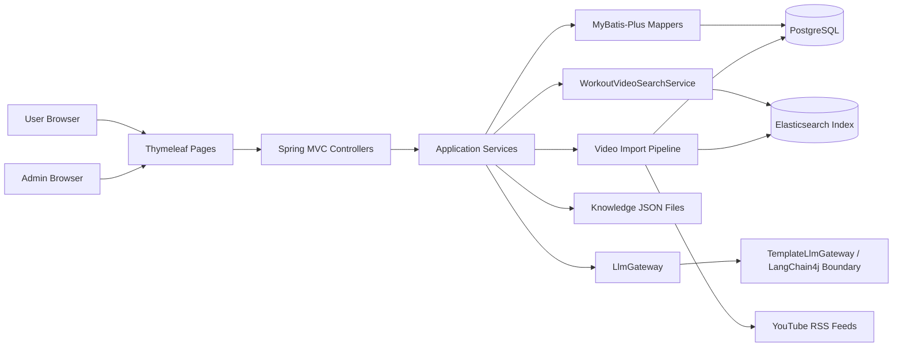
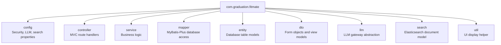
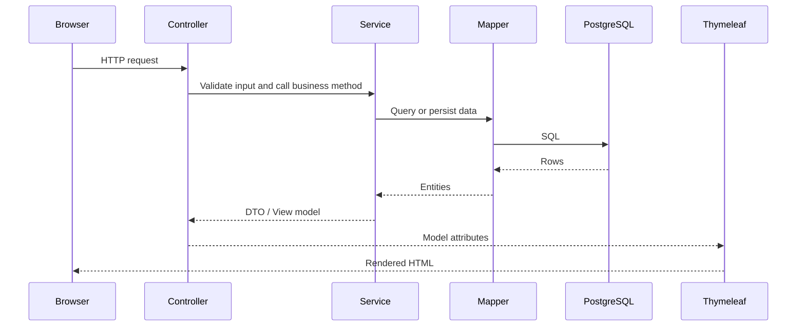
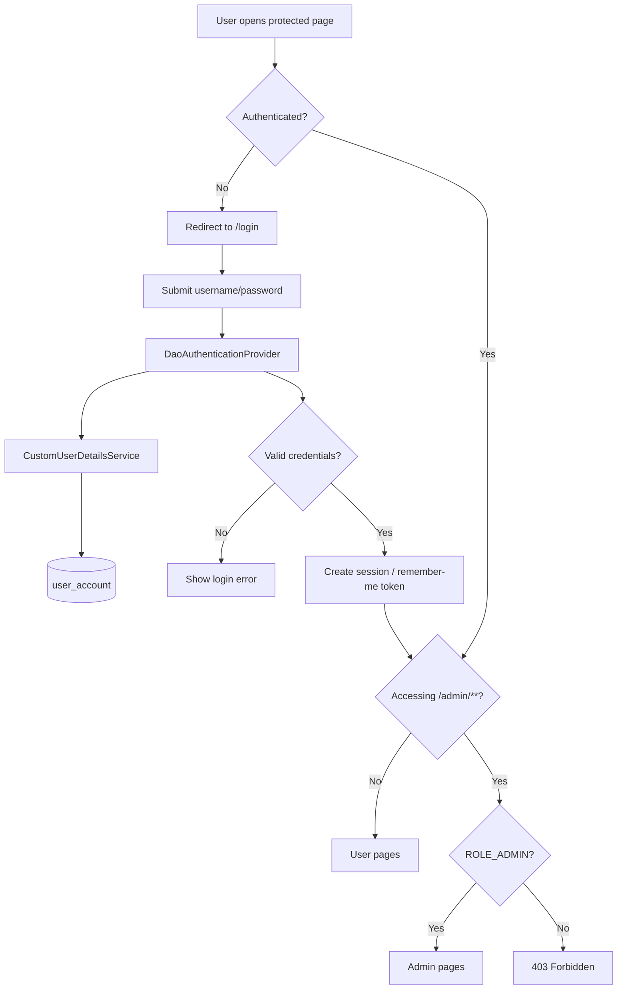
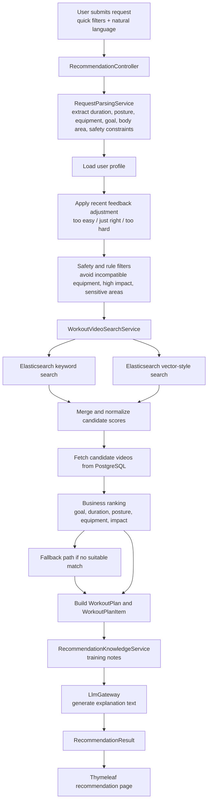
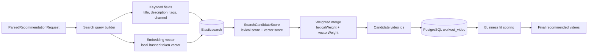
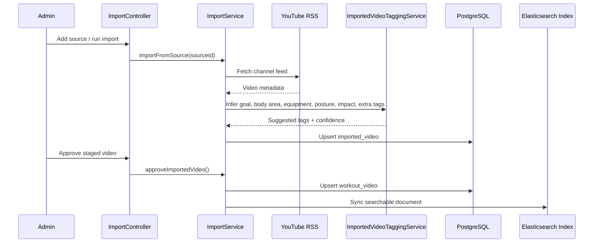
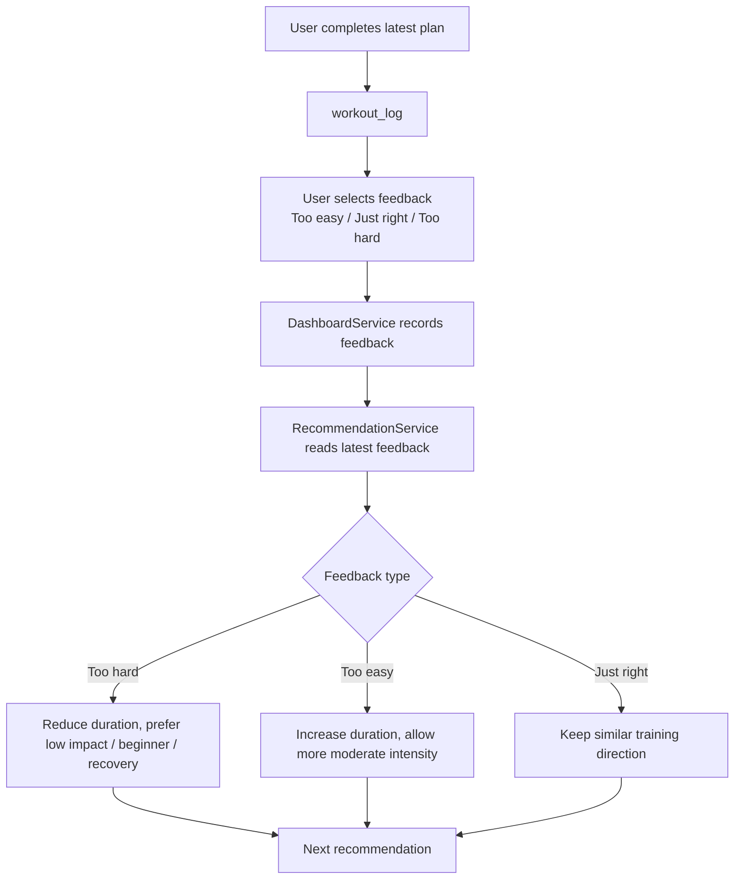
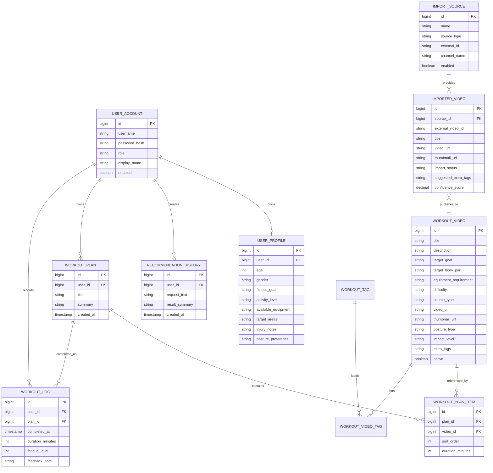
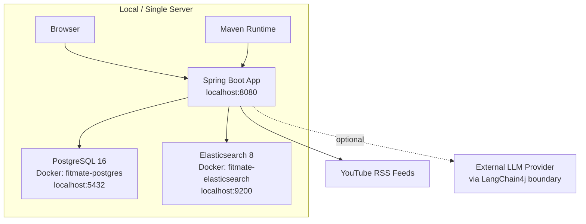

# FitMate Architecture Overview

FitMate is a Java-based personalized workout recommendation platform. Users maintain a training profile, describe their exercise needs in natural language, receive safe video-based workout recommendations, and record completion feedback. Administrators maintain the workout catalog, import YouTube channel content, review suggested tags, and keep the recommendation library clean.

## 1. Technology Stack

| Layer | Technology | Responsibility |
| --- | --- | --- |
| Frontend rendering | Thymeleaf, Bootstrap, vanilla JavaScript | Server-rendered pages, forms, language switching, lightweight UI interactions |
| Web framework | Spring Boot 3 | MVC routing, dependency injection, configuration, application lifecycle |
| Security | Spring Security | Login, remember-me token, role-based access control |
| Data access | MyBatis-Plus, MyBatis XML | CRUD operations and custom SQL queries |
| Database | PostgreSQL 16 | Users, profiles, videos, plans, logs, imports, recommendation history |
| Migration | Flyway | Versioned schema creation and seed data |
| Search | Elasticsearch 8 | Keyword and semantic-style workout video retrieval |
| LLM integration boundary | LangChain4j dependency + `LlmGateway` abstraction | Recommendation explanation generation, replaceable provider boundary |
| Local AI support | `TemplateLlmGateway`, `EmbeddingService`, knowledge JSON | Offline explanation fallback, local embedding vector generation, training knowledge notes |
| Deployment | Docker Compose + Maven | Local PostgreSQL, Elasticsearch, Spring Boot runtime |

## 2. High-Level Architecture

The system is intentionally designed as a layered monolith. This keeps the graduation-scale implementation understandable while still preserving clear module boundaries: web controllers do not directly query the database, recommendation logic is isolated in services, and search/LLM capabilities are wrapped behind replaceable interfaces.

## 3. Package Structure

## 4. MVC Request Flow

Example pages following this pattern:

- `HomeController` renders dashboard and records latest workout feedback.
- `ProfileController` manages user training profile.
- `RecommendationController` receives structured quick filters plus natural language request.
- `WorkoutVideoController` lists and displays workout videos.
- `AdminVideoController` and `AdminImportController` manage catalog operations.

## 5. Authentication And Authorization

Security rules:

- Public: `/`, `/login`, `/register`, `/css/**`
- Authenticated user: dashboard, profile, videos, recommendations
- Admin only: `/admin/**`
- Remember-me token storage: `persistent_logins`
- UI role separation: admin navigation entries are rendered only for `ROLE_ADMIN`

## 6. Recommendation Pipeline

Important design point: the system does not let a large language model directly choose arbitrary videos. The recommendation process is controlled by structured parsing, rule filtering, SQL/Elasticsearch retrieval, deterministic ranking, and only then explanation generation. This makes the result easier to justify and safer to demonstrate.

## 7. Search And Ranking Design

Current search behavior:

- Keyword matching handles direct user intent such as "chair workout", "low impact", "back".
- Vector-style matching improves recall for semantically related text.
- Candidate scores are exposed in the recommendation result as ranking explanations.
- If Elasticsearch fails or returns no safe candidate, the system falls back to database retrieval.

## 8. Content Import Pipeline

This pipeline reduces manual content entry. The administrator still controls final approval, but source metadata, thumbnails, inferred tags and duplicate handling are automated.

## 9. Feedback Loop

The feedback loop is simple but useful for product completeness: the dashboard is not only a display page; it changes the next recommendation behavior.

## 10. Database ER Diagram

## 11. Deployment Diagram

Development startup:

1. `docker compose up -d`
2. `mvn spring-boot:run`
3. Open `http://localhost:8080`

## 12. Main Runtime Components

| Component | Main classes | Purpose |
| --- | --- | --- |
| Authentication | `SecurityConfig`, `CustomUserDetailsService`, `RegistrationService` | Login, roles, remember-me, registration |
| Dashboard | `HomeController`, `DashboardService`, `DashboardView` | Progress rings, weekly rhythm, recent logs, feedback |
| Profile | `ProfileController`, `UserProfileService`, `UserProfile` | Training profile and safety constraints |
| Video library | `WorkoutVideoController`, `WorkoutVideoService`, `WorkoutVideo` | Public catalog browsing and detail pages |
| Recommendation | `RecommendationController`, `RecommendationService`, `RequestParsingService` | Parse request, filter, retrieve, rank, save plan |
| Search | `WorkoutVideoSearchService`, `ElasticsearchWorkoutVideoSearchGateway`, `EmbeddingService` | Hybrid recall and score explanation |
| Knowledge notes | `RecommendationKnowledgeService`, `RecommendationKnowledgeNote` | Static training guidance selected by request/profile context |
| LLM boundary | `LlmGateway`, `TemplateLlmGateway` | Explanation generation abstraction |
| Import operations | `AdminImportController`, `VideoImportService`, `ImportedVideoTaggingService` | YouTube feed import, suggested tags, approval |
| Admin catalog | `AdminVideoController`, `WorkoutVideoService` | Manual video editing and batch tag cleanup |

## 13. Why This Architecture Is Suitable

The architecture emphasizes reliability and explainability over a fully autonomous AI agent. Exercise recommendation is a safety-sensitive domain, so FitMate uses deterministic filtering and ranking before generating user-facing explanations. Elasticsearch improves retrieval quality, PostgreSQL remains the source of truth, and the LLM integration is isolated behind a gateway so the system can still return recommendations when the LLM provider is unavailable.

Key strengths:

- Clear separation between user-facing training flow and admin content operations.
- Role-based access control protects catalog management functions.
- Hybrid search improves recall while preserving SQL fallback.
- Recommendation history, workout plans and logs create a closed user loop.
- Content import pipeline makes the video library maintainable at scale.
- Flyway migrations make the schema reproducible across machines.

